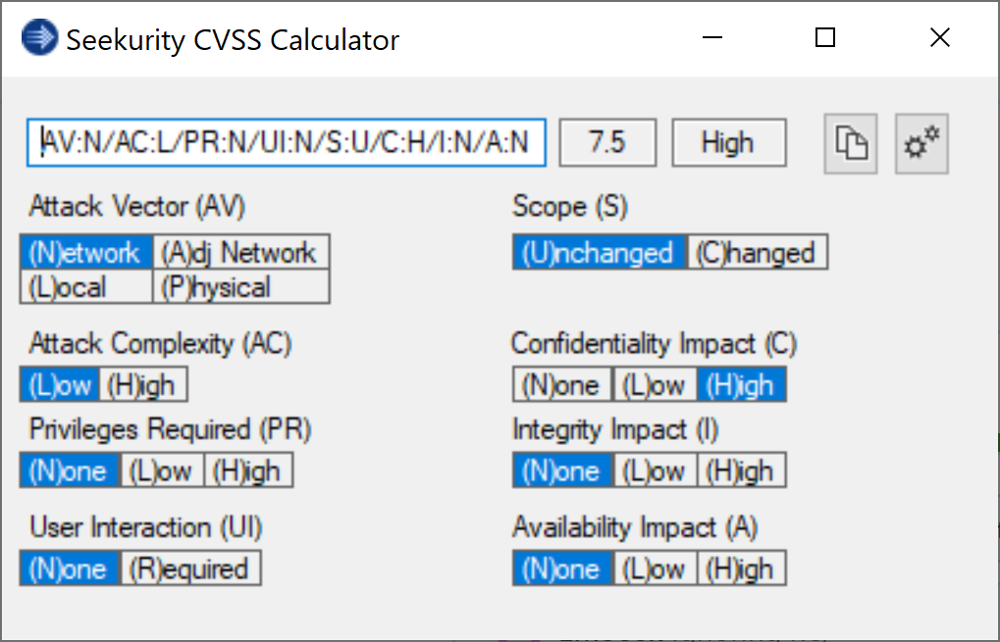
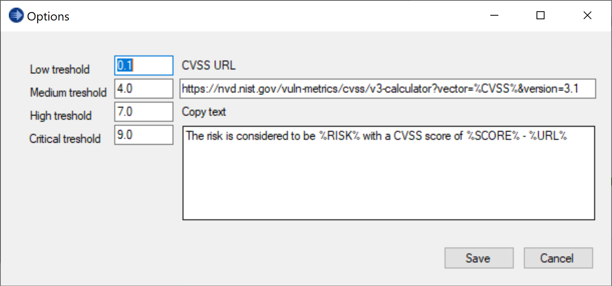
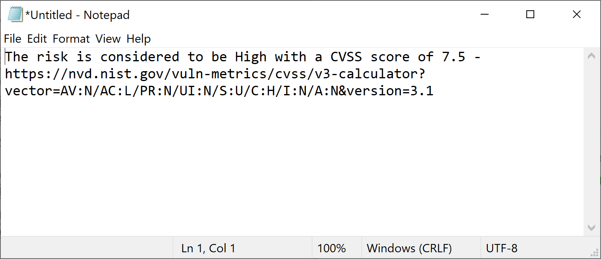

CVSS-Calculator
==========================================================================
This is a simple desktop CVSS calculator aimed at making report writing
easier. The main interface should be familiar for anyone who has used a
CVSS calculator before:

CVSS score can be generated in several ways:
 * Clicking on the buttons under each attribute
 * Rapidly, by using arrow keys (Up/Down value, Left/Right attribute)
 * Typing or pasting the vector string

Additionaly there are some options that lets you set risk level thresholds,
link to CVSS rating online and a risk reporting template.

There are a few templates provided in the calculator and these can easily be swapped between in the options window.
And custom templates are easily added, give it a new name and write the text then click save.

Templating supports the following variables:
 * %CVSS% Vector string
 * %SCORE% CVSS numerical score
 * %RISK% Risk rating based on the CVSS score treshold

Clicking on the copy button, or pressing ctrl+c inside the CVSS textbox
will copy the templated text with the variables filled in, ready to be
pasted into your security report:

